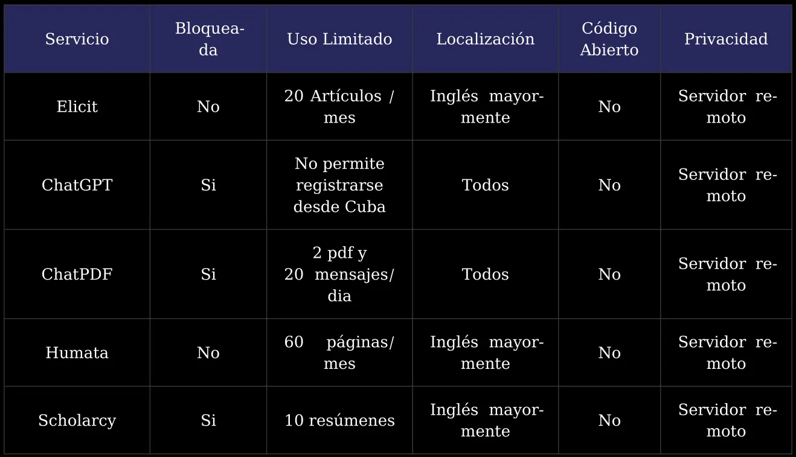

  

     Universidadad de las Ciencias Informáticas - 2025 
  

  
Desarrollo de una herramienta basada   en LLM y RAG para optimizar el análisis   de artículos científicos.
  

  

    
       Autor   
      Joaquin E. Rivas Sánchez
    
    
       Tutores   
       Msc. Angel Alberto Vazquez Sánchez  
       Msc. Lisset Salazar Gómez
    
  

<!--
Hola mi nombre es Joaquin y ahora les presentare mi tesis titulada:

**LEER**
-->

---
layout: image
image: './assets/ai.webp'
---

<!--
En los últimos años, la IA Generativa ha experimentado un **crecimiento sin precedentes**, impulsada por avances en los modelos de aprendizaje profundo.

Gracias a esto, se han abierto posibilidades para automatizar procesos que antes requerían un alto grado de intervención humana.
-->

---

# Problema de investigación

¿Cómo desarrollar una herramienta de IA accesible, eficiente y localizable que permita a investigadores cubanos analizar documentos científicos de forma semi-automatizada, aprovechando los modelos de lenguaje de gran tamaño y generación aumentada por recuperación (RAG), sin depender de infraestructura costosa o conexión a internet?

<!--
Esto nos lleva al siguiente problema de investigación

**LEER**
-->

---

# Objeto de Estudio

Modelos de Lenguaje de Gran Tamaño (LLM).

 
 

# Campo de Acción

Extensión de LLM basado en RAG.

---

# Objetivo General

Desarrollar una herramienta de código abierto, basada en LLM y RAG, para el análisis semiautomático de artículos científicos en PDF, adaptada al contexto tecnológico y lingüístico de Cuba.

 

# Tareas de investigación

+ Realizar estudio del estado del arte sobre el objeto de estudio y campo de acción.
+ Elaborar una propuesta de solución al problema tratado.
+ Validar que la propuesta responde a los objetivos planteados.

<!-- # Homologos

 Elicit 

<SlidevVideo autoplay controls class="rounded-xl">
  <source src="./assets/elicit.mp4" type="video/mp4" />
  

    Your browser does not support videos. You may download it
    <a href="./assets/elicit.mp4">here</a>.
  

</SlidevVideo> -->

<!--
1. **Elicit** es una herramienta de inteligencia artificial diseñada para ayudar en la investigación académica, está enfocado en la revisión y síntesis de literatura científica.

El usuario introduce la pregunta y el sistema realiza un proceso complejo de:
    - recoleccion de articulos relevantes.
    - extrae la informacion relevante de cada uno.
    - genera un articulo en forma de Survey resumiendo y citando lo encontrado.
-->

---

# Sistemas Homologos

<!--
Los sistemas existentes cuentan con limitaciones que afectan su usabilidad en el contexto nacional como:

1. Se encuentran bloqueadas para Cuba.

2. Cuantan con limitaciones en sus planes gratuitos y la imposiblidad de pagar planes de pago.

3. Estan enfocadas mayormente al idioma ingles.

Estas limitaciones dan paso a desarrollar una solucion que sea acorde a los problemas de Cuba.
-->

---
layout: image-right
image: './assets/chatgpt.webp'
---

# Limitaciones de los LLM

<v-clicks>

- Conocimiento estático.

- Respuestas no verificables.

- Sesgo en las respuestas.

- Límite en la longitud de la información que pueden recibir.

</v-clicks>

<!--
Una solucion que solo haga uso de los LLM no es suficiente debido a limitaciones como:

1. Nuevo conocimiento requiere un nuevo reentrenamiento del modelo.

2. Las respuestas son realistas pero muchas veces erroneas.

3. El modelo suele tener pobre rendimiento en las areas del conocimiento poco representadas en los datos de entrenamiento.

4. Los modelos tienen un limite de palabras que pueden recibir.

Estas limitaciones son fundamentales de las arquitectura actual de estos modelos por eso se necesita una forma de rodear estas limitaciones y utilizar el conocimiento base de estos modelos mientras se extiende con nueva y mas relevante informacion.
-->

---
layout: image
image: "./assets/proto.webp"
---

## Propuesta de solución

<!--
El prototipo se enfoca en rodear estas limitaciones al utilizar una tecnica llamada:

Generacion Aumentada por Recuperacion la cual se basa en introducir el conocimiento relevante para generar una respuesta junto con la pregunta del usuario.

.

El prototipo extiende esta idea haciendo uso de tecnicas mas avanzadas:

- Las preguntas complejas se **descomponen** en multiples sub preguntas.

- Se utiliza una busqueda la cual combina multiples metodos de recuperacion.

- Los documentos recuperados son **reordenados** y filtrados.

- Los pasos pueden ser repetidos si la respuesta no esta completa.
-->

---
layout: image
image: "./assets/tech.webp"
---
## Tecnologías

<!--
- Python como lenguaje de desarrollo.

- vLLM como la biblioteca que permite la ejecucion de modelos LLM.

- PyTorch y NumPy para algunos algoritmos como el modulo de comparacion.

- Gradio para generar una interfaz de grafica sencilla para interactual con el sistema.
-->

---

# Metodología de Desarrollo

La metodología "Programación Extrema" (XP) generó los siguientes artefactos:

- Historias de Usuario (12).

- Tareas de ingenieria (12).

- Pruebas Unitarias.

- Plan de Iteración (2).

- Estándares de Codificación

  - Patrón arquitectónico.

  - Patrones de diseño.

---
layout: image
image: ./assets/ragas.webp
---

# Evaluación

<!--
A continuacion se muestran los resultados de utilizar las metricas definidas por RAGAS:

Los resultados obtenidos fueron los esperados y marcan el camino para enfocar futuras mejoras.

EXTRA:
- Faithfulness: respuesta generada vs informacion recuperada.
    -> La respuesta generada no se adiere en la mayoria de los casos a la informacion recuperada.

- Context Recall: informacion relevante recuperada / toda la informacion recuperada.
    -> El prototipo en la mayoria de los casos probados recupera la informacion relevante.

- Factual Correctness: respuesta generada vs la de referencia.
    -> La respuesta representa la mayoria de los hechos en la respuesta de referencia.

Esto nos da a entender que si bien los documentos relevantes se encuentran en su mayoria,
hay presencia de mucho ruido lo cual lleva a que el modelo ignore la mayoria de esta.
-->

---
layout: image
image: "./assets/performance.webp"
---

# Pruebas de rendimiento

<!--
Las pruebas de rendimiento son esenciales porque ayudan a tomar decisiones informadas sobre
optimización, escalabilidad y viabilidad del sistema en distintos entornos de implementación.

Las pruebas fueron ejecutados en un Hardware modesto y muestran resultados prometedores.

1. La generacion de respuestas se mantiene debajo de los 3.5 segundos.

2. La creacion de embeddings esta dentro de los 3 segundos para procesar hasta 1000 oraciones.
-->

---
layout: image
image: ./assets/unit-test-results.webp
---

# Pruebas de Unidad

<!--
Las pruebas de unidad se encargan de validar el comportamiento correcto de
componentes individuales de forma aislada.

Estos fueron los resultados en las 2 iteraciones del desarrollo.
-->

---

# Conclusiones

- El uso de la metodología XP, junto con una arquitectura en capas y el empleo de tecnologías como Python, vLLM y Gradio, permitió desarrollar un sistema funcional y acorde a los objetivos del proyecto.

- Las evaluaciones mostraron un rendimiento aceptable y esperado, demostrando la validez del prototipo.

- El prototipo demostró viabilidad en hardware modesto, proporcionando una base sólida para futuras mejoras en generación y actualización documental continua.

---

# Recomendaciones

- **Extender las fuentes de información mediante agentes web** que se integren con plataformas de investigación y repositorios académicos locales e internacionales.

- **Explorar lenguajes y técnicas de programacion de alto rendimiento** (C/C++ o Mojo) para aprovechar mejor los recursos.

- Integrar un **mejor preprocesamiento de los archivos**, utilizando OCR y detección del layout y de fórmulas matemáticas.

- Investigar **GraphRAG** para integrar grafos de conocimiento, para mejorar la precisión, contextualización y relevancia en la generación de respuestas.

<!--
- Evaluar **arquitecturas distribuidas**, desplegando modelos ligeros y especializados en nodos heterogéneos para mejorar escalabilidad.

- Combinar fine-tuning con RAG para aumentar la fidelidad de las respuestas ajustando modelos a dominios concretos.
-->

---
layout: image
image: "./assets/rag.webp"
---

---

  

     Universidadad de las Ciencias Informáticas - 2025 
  

  
Desarrollo de una herramienta basada   en LLM y RAG para optimizar el análisis   de artículos científicos.
  

  

    
       Autor   
      Joaquin E. Rivas Sánchez
    
    
       Tutores   
       Msc. Angel Alberto Vazquez Sánchez  
       Msc. Lisset Salazar Gómez
    
  

---

# Preguntas

---

# Agradecimientos

