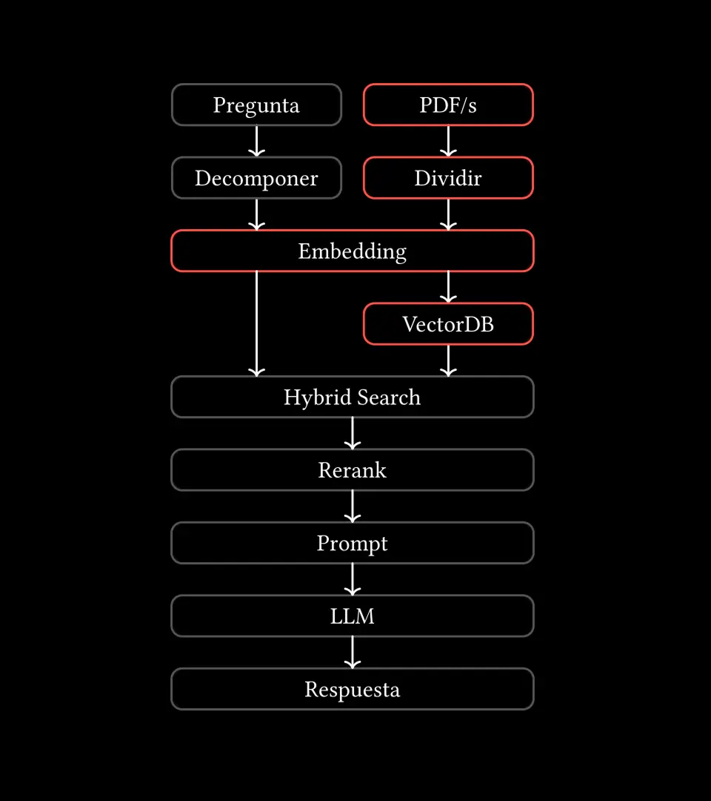
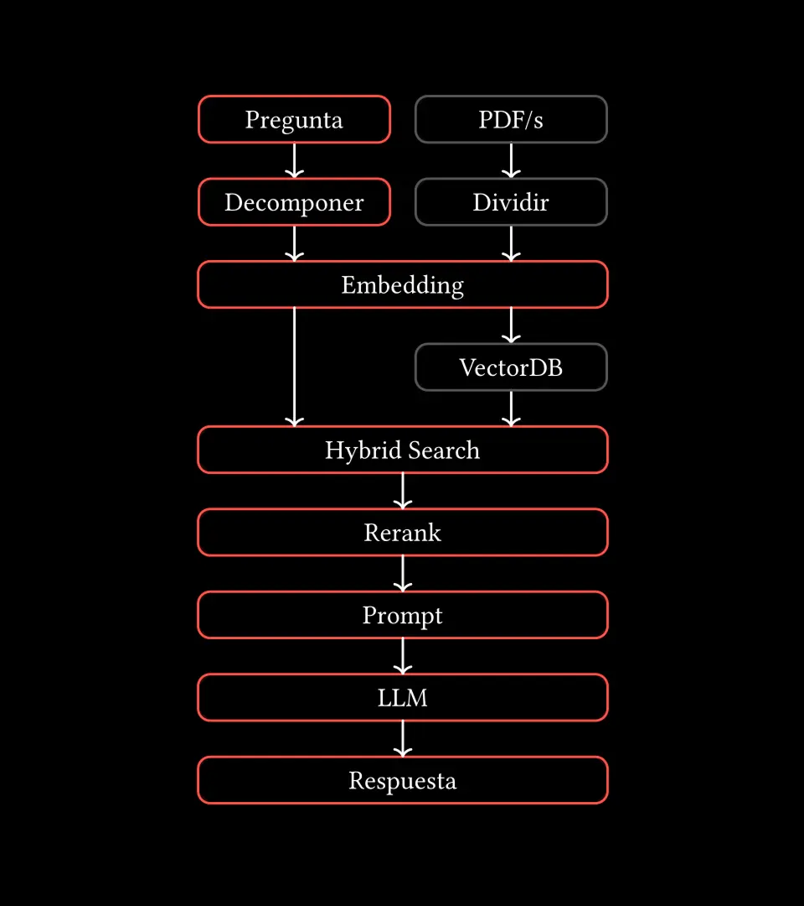

  

     Universidad de las Ciencias Informáticas - 18/7/2025 
  

  
Desarrollo de una herramienta basada en LLM y RAG para asistir el análisis de artículos científicos.
  

  

    
       Autor   
      Joaquin E. Rivas Sánchez
    
    
       Tutores   
       Msc. Angel Alberto Vazquez Sánchez  
       Msc. Lisset Salazar Gómez
    
  

<!--
Buenos días, mi nombre es Joaquín Rivas Sánchez y hoy presentaré mi tesis titulada:

**LEER**
-->

---
layout: image
image: "./assets/ai.webp"
---

<!--
"En los últimos anos, la IA generativa ha revolucionado la investigación científica.
Herramientas como ChatGPT, Elicit o Semantic Scholar permiten analizar miles de artículos en segundos, acelerando descubrimientos en medicina, ingeniería y otros campos.

-TODO: Según Nature, el 83% de los investigadores usan ya IA para revisiones bibliográficas...

Sin embargo, estas herramientas presentan limitaciones prácticas para entornos con recursos limitados como el cubano.
-->

---
layout: image
image: ./assets/homologos.webp
---

# Sistemas Homologos

<!--
- Muchos servicios están bloqueados para usuarios en Cuba.
- Las opciones gratuitas son muy limitadas y el acceso a planes de pagos es inviable por restricciones económicas y politicas.
- Además, la mayoría de estas herramientas están enfocadas para un público angloparlante, lo que reduce su accesibilidad local.

Estas limitaciones generan una brecha tecnológica que limita la capacidad de los investigadores cubanos para competir en igualdad de condiciones en la ciencia global.
-->

---

# Problema de investigación

¿Cómo desarrollar una herramienta de IA accesible, eficiente y localizable que permita a investigadores cubanos analizar documentos científicos de forma semi-automatizada, aprovechando los modelos de lenguaje de gran tamaño y generación aumentada por recuperación (RAG), sin depender de infraestructura costosa o conexión a internet?

<!--
Esto nos lleva al siguiente problema de investigación

**LEER**
-->

---

# Objeto de Estudio

Modelos de Lenguaje de Gran Tamaño (LLM).

 
 

# Campo de Acción

Extensión de LLM basado en RAG.

---

# Objetivo General

Desarrollar una herramienta de código abierto, basada en LLM y RAG, para el análisis semiautomático de artículos científicos en PDF, adaptada al contexto tecnológico y lingüístico de Cuba.

 

# Tareas de investigación

+ Realizar estudio del estado del arte sobre el objeto de estudio y campo de acción.
+ Elaborar una propuesta de solución al problema tratado.
+ Validar que la propuesta responde a los objetivos planteados.

<!-- 
Para dar cumplimiento al objetivo propuesto se proponen un conjunto de *tareas de investigación*:
-->

---
layout: image
image: "./assets/chatgpt.webp"
---

## ¿Qué es RAG y por qué es importante?

 

<v-clicks>

<a>Limitaciones de los LLM</a> \
✖ **Conocimiento congelado**

✖ **Respuestas no verificables**

✖ **Pérdida de contexto**

</v-clicks>

<!--
RAG (Retrieval-Augmented Generation) es una técnica que combina lo mejor de dos mundos:
1️⃣ La capacidad generativa de los LLMs para entender y sintetizar información.
2️⃣ Un sistema de recuperación que busca datos actualizados y relevantes en tiempo real.

Esto resuelve tres problemas clave de los LLMs tradicionales:

✖ **Conocimiento congelado**: Los modelos base solo saben lo que aprendieron en su entrenamiento.
✔ **Con RAG**: Siempre accede a la información más reciente.

✖ **Respuestas no verificables**: Como 'cajas negras' que no muestran sus fuentes.
✔ **Con RAG**: Mayor control de la informacion y posibilidad de filtrala y citarla.

✖ **Pérdida de contexto**: Los LLMs comunes olvidan detalles cuando procesan mucho texto.
✔ **Con RAG**: Mejora la consistencia en el análisis de múltiples documentos al enfocarse en los fragmentos más relevantes para cada consulta.

En nuestra herramienta, este enfoque permite al usuario: Integrar conocimiento nuevo proveniente de documentos externos al sistema.
-->

---
layout: two-cols
---

<template v-slot:default>

## Propuesta de solución

<SlidevVideo autoplay>
  <source src="./assets/video-send-pdf.mp4" type="video/mp4"  />
</SlidevVideo>

</template>

<template v-slot:right>

</template>

<!--
El prototipo realizado consiste del siguiente flujo:

El usuario puede iniciar una conversacion e introducir un documento en formato pdf
El sistema procesara este
    - dividiento el contenido en parrafos.
    - estos son transformados del lenguaje natural a una representacion numerica que
        mantiene el significado semantico de este.
    - estos son guardados en una base de datos.
-->

---
layout: two-cols
---

<template v-slot:default>

## Propuesta de solución

<SlidevVideo autoplay class="h-full">
  <source src="./assets/video-query.mp4" type="video/mp4"  />
</SlidevVideo>

</template>

<template v-slot:right>

</template>
<!--
Posteriormente, el usuario al introducir una consulta
El sistema:
    - convierte esta a la misma representacion numerica.
    - realiza una busqueda utilizando multiples metodos de recuperacion
        para obtener los documentos mas relevantes a la consulta.
    - los documentos son reordenados basados en la relevancia.
    - luego estos sirven de contexto para responder la consulta utilizando el LLM.
-->

---
layout: image
image: "./assets/tech.webp"
---
# Tecnologías

<!--
Se utilizo:

- Python como lenguaje de programación.

- vLLM como biblioteca para ejecutar los modelos de IA.

- Gradio como biblioteca para construir una interfaz grafica simple.

- El modelo LLM `Qwen3-4B` y `BGE-M3` como modelo de generacion de embeddings.
    `BGM-M3-reranker` como modelo reranker.
-->

---

# Metodología de Desarrollo

La metodología "Programación Extrema" (XP) generó los siguientes artefactos:

- Historias de Usuario (12).

- Tareas de ingenieria (12).

- Pruebas Unitarias.

- Plan de Iteración (2).

- Estándares de Codificación

  - Patrón arquitectónico  (Arquitectura por Capas) 

  - Patrones de diseño.

<!-- 
El proyecto siguió la metodología ágil XP, la cual genero los siguientes artefactos ingenieriles.
 -->

---
layout: image
image: "./assets/performance.webp"
---

## Resultados y evaluación

<!--
- Funciona con un rendimiento aceptable en hardware modesto.

  - Con tiempos que no superan los 3.5 seg en las pruebas realizadas a la generacion de respuestas.

  - 3 seg a la creacion de embeddings
-->

---
layout: image
image: ./assets/ragas.webp
---

## Resultados y evaluación

<!--
Las pruebas realizadas validaron que el prototipo cumple con los objetivos planteados:

- Proporciona respuestas precisas y contextualizadas, que situan al prototipo como una base robusta para ser extendida en el futuro.

A continuacion se muestran los resultados de utilizar las metricas definidas por RAGAS para evaluar el sistema:

- Faithfulness: respuesta generada vs informacion recuperada.
    -> La respuesta generada no se adiere en la mayoria de los casos a la informacion recuperada.
    -> Lo cual puede deberse al modelo LLM utilizado.

- Context Recall: porciento de informacion relevante recuperada / toda la informacion recuperada.
    -> El prototipo en la mayoria de los casos probados recupera la informacion relevante.

- Factual Correctness: respuesta generada vs la de referencia.
    -> La respuesta representa la mayoria de los hechos en la respuesta de referencia.

Los resultados obtenidos fueron los esperados y marcan el camino para enfocar futuras mejoras.

Esto nos da a entender que si bien los documentos relevantes se encuentran en su mayoria, hay presencia de mucho ruido lo cual lleva a que el modelo ignore la mayoria de esta.
-->

---
layout: image
image: ./assets/unit-test-results.webp
---

## Pruebas de Unidad

<!--
Las pruebas de unidad se encargan de validar el comportamiento correcto de
componentes individuales de forma aislada.

Estos fueron los resultados en las 2 iteraciones del desarrollo.
-->

---

# Conclusiones

- El uso de la metodología XP, junto con una arquitectura en capas y el empleo de tecnologías como Python, vLLM y Gradio, permitió desarrollar un sistema funcional y acorde a los objetivos del proyecto.

- Las evaluaciones mostraron un rendimiento aceptable y esperado, demostrando la validez del prototipo.

- El prototipo demostró viabilidad en hardware modesto, proporcionando una base sólida para futuras mejoras en generación y actualización documental continua.

---

# Recomendaciones

- **Extender las fuentes de información mediante agentes web** que se conecten a repositorios académicos locales e internacionales.

- **Explorar lenguajes y técnicas de programación de alto rendimiento** para optimizar recursos.

- **Mejorar el preprocesamiento** de documentos con OCR y detección de estructuras complejas como fórmulas matemáticas.

- Investigar la incorporación de grafos de conocimiento (**GraphRAG**) para aumentar la precisión y contextualización.

---
layout: section
---

# Agradecimientos ...

<!-- 
Le agradezco a mis tutores por apoyarme con la conformacion de la tesis y las revisiones de la misma.

A mis padres por siempre apoyarme con todo lo que necesite en el camino.
-->

---

  

     Universidad de las Ciencias Informáticas - 18/7/2025 
  

  
Desarrollo de una herramienta basada   en LLM y RAG para optimizar el análisis   de artículos científicos.
  

  

    
       Autor   
      Joaquin E. Rivas Sánchez
    
    
       Tutores   
       Msc. Angel Alberto Vazquez Sánchez  
       Msc. Lisset Salazar Gómez
    
  

